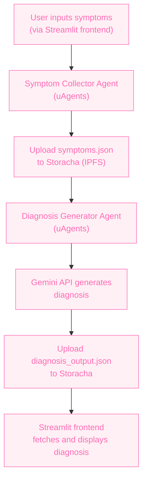

# 🧠 Staba Architecture

## 📐 Overview

This architecture outlines the flow of data and agent interactions within the Staba system. It visually represents how the system processes user-reported symptoms and generates a diagnosis using autonomous agents, IPFS storage, and the Gemini API.

---

## 🔄 Flowchart Diagram (Mermaid)

---

## 🧩 Component Breakdown

### 🧍 Streamlit Frontend
- Accepts user input (symptoms).
- Displays AI-generated diagnosis report.

### 🤖 Symptom Collector Agent (uAgents)
- Collects user symptoms.
- Uploads structured data (`symptoms.json`) to Storacha (IPFS).

### 📦 Storacha (IPFS)
- Decentralized file storage.
- Enables data access between agents.

### 🤖 Diagnosis Generator Agent (uAgents)
- Retrieves symptom data from Storacha.
- Calls Gemini API to generate diagnosis.
- Stores `diagnosis_output.json` back to Storacha.

### 🔮 Gemini API
- Large Language Model API (by Google).
- Processes input data and produces possible diagnoses and recommendations.

---

## ⚙️ Future Expansion

This architecture is modular and extensible:
- More agents can be added (e.g., nutrition analysis, lifestyle recommender).
- Diagnosis accuracy can improve with localized LLM tuning.
- New frontend interfaces can connect to the same agent pipeline.

---

