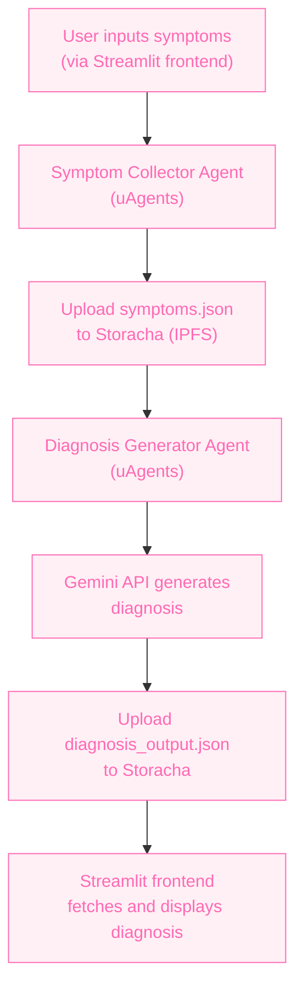

# 🧠 Staba

An intelligent ensemble AI system built with **Fetch.ai's uAgents**, **Storacha decentralized storage**, and **Gemini API** that collects user-reported health symptoms and provides AI-generated diagnosis reports. It also anonymously stores data for medical research.

---

## 📌 Overview

This project aims to bridge the gap between symptom self-reporting and actionable health insights. It enables users to receive personalized health feedback while contributing anonymized data to improve healthcare AI models.

- Agent 1 (Symptom Collector Agent): Accepts user health symptoms and uploads to Storacha.
- Agent 2 (Diagnosis Generator Agent): Fetches symptoms from Storacha, uses Gemini API to analyze, then outputs a report and uploads back to Storacha.

---

## 🚀 Key Technologies

- [🔁 Fetch.ai's uAgents](https://github.com/fetchai/uAgents): For building autonomous, decentralized AI agents.
- [📦 Storacha](https://docs.storacha.network): Decentralized, IPFS-backed data storage with access control.
- [🧠 Gemini API](https://ai.google.dev/gemini-api/docs): LLM API used to analyze symptoms and generate health insights.

---

## 🧩 Architecture


## 💡 Features

- **AI Agent Collaboration**: Two autonomous agents communicating via Storacha and sharing context.
- **Ensemble Learning**: Agent 2 learns from structured input by Agent 1 and builds insights.
- **Decentralized Storage**: All files uploaded/downloaded from IPFS via Storacha.
- **Research-Grade Data**: Anonymized symptom–diagnosis pairs are stored for future medical AI use.
- **Extensible**: Easily expandable to include more agents (e.g., nutrition, treatment suggester).

---

## 🧑‍⚕️ Use Cases

- Telehealth platforms
- Virtual health assistants
- Clinics analyzing aggregated symptom patterns
- Self-care mobile apps

---

## 💸 Business Model

- **Freemium model**: Free for individuals with optional premium features (e.g., historical data, export PDF reports).
- **B2B Licensing**: Clinics and health tech startups can license the anonymized data insights or integrate the diagnosis agent into their systems.

---

## 📁 Project Overview
The goal of this project is to enable **two autonomous AI agents** (Symptom Collector and Diagnosis Generator) to:
1. Collect user symptoms
2. Upload data to IPFS using `storacha` CLI (`w3`)
3. Send an IPFS link to another agent
4. Generate a diagnosis using a Gemini AI API

---

## ⚙️ Step-by-Step Setup

---

### ✅ 1. Install [Poetry](https://python-poetry.org/)
Poetry is used for Python dependency and environment management.

```bash
curl -sSL https://install.python-poetry.org | python3 -
```

After installation, add Poetry to your PATH if it's not automatically added:

```bash
export PATH="$HOME/.local/bin:$PATH"
```

Verify:

```bash
poetry --version
```

---

### ✅ 2. Create Project with Poetry

```bash
poetry new staba
cd staba
```
---

### ✅ 3. Add Dependencies

Install `uagents` and `python-dotenv`:

```bash
poetry add uagents python-dotenv
```

---

### ✅ 4. Install `storacha` CLI for IPFS uploads

Use `w3` CLI for uploading files to IPFS via Web3.Storage.

```bash
npm install -g @web3-storage/w3cli
```

Login:

```bash
w3 login
```

Create or switch to your working space:

```bash
w3 space create collector_space
w3 space use collector_space
```

---

### ✅ 5. Create `models.py`

This file contains a shared message model both agents can use:

```python
# models.py
from uagents import Model

class IPFSMessage(Model):
    ipfs_link: str
```

---

### ✅ 6. Create `symptom_collector_agent.py`

This agent:
- Prompts user for symptoms
- Saves to a JSON file
- Uploads to IPFS via `w3`
- Sends IPFS link to diagnosis agent

---

### ✅ 7. Create `diagnosis_generator_agent.py`

This agent:
- Receives IPFS link
- Logs the link (diagnosis generation will be added)
---

### ✅ 8. Setup `.env` File

Create a `.env` file for storing your Gemini API key:

```dotenv
GEMINI_API_KEY=your_gemini_api_key_here
```

---

### ✅ 9. Run the Agents

> Run these in separate terminals.

**Terminal 1: Run Diagnosis Agent**

```bash
poetry run python diagnosis_generator_agent.py
```

Copy the address printed in the terminal.

---

**Terminal 2: Run Symptom Collector**

```bash
poetry run python symptom_collector_agent.py
```

Paste the diagnosis agent's address inside the script, rerun if needed.

---

## ✅ Agent Communication Check

You should see a log like this in the Diagnosis Agent terminal:

```
✅ Received IPFS link: https://w3s.link/ipfs/bafy...
```


You can expand this by downloading the IPFS JSON, extracting the symptoms, and using Gemini API to generate diagnoses.

---

## ❗ Common Pitfalls

| Issue | Fix |
|------|-----|
| No message received | Check both agents are running and using correct ports/addresses |
| IPFS link not received | Make sure you're uploading and pasting correct URL |
| Gemini API not responding | Check `GEMINI_API_KEY` is valid and endpoint is correct |
| Can't install `ucan` | You don’t need it for agent-to-agent comms |

---

## ✅ Summary

- ✅ Poetry used to manage the project
- ✅ Agents created with `uagents`
- ✅ IPFS integration via `storacha` CLI (`w3`)
- ✅ JSON file upload and message exchange via agent messaging
- ✅ Gemini AI integration can be layered on top

---

Let me know if you'd like this exported as a `.md` file or want the diagnosis logic added too.

## 📣 Collaboration

This project is built for the **Hot AI Integrations, Hotter Storage
** Hackathon, focused on building **ensemble learning AI agents** powered by decentralized storage.
## Let's Collaborate!

I'm always open to collaboration and would love to improve this project further with your input. Feel free to reach out to me via email at [fyattani@gmail.com](mailto:fyattani@gmail.com) or on X: [@fatumayattani](https://x.com/fatumayattani).


