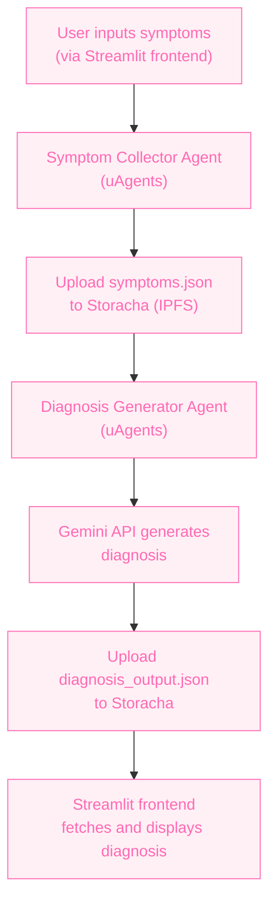

# 🧠 Staba

An intelligent ensemble AI system built with **Fetch.ai's uAgents**, **Storacha decentralized storage**, and **Gemini API** that collects user-reported health symptoms and provides AI-generated diagnosis reports. It also anonymously stores data for medical research.

---

## 📌 Overview

This project aims to bridge the gap between symptom self-reporting and actionable health insights. It enables users to receive personalized health feedback while contributing anonymized data to improve healthcare AI models.

- Agent 1 (Symptom Collector Agent): Accepts user health symptoms and uploads to Storacha.
- Agent 2 (Diagnosis Generator Agent): Fetches symptoms from Storacha, uses Gemini API to analyze, then outputs a report and uploads back to Storacha.

---

## 🚀 Key Technologies

- [🔁 Fetch.ai's uAgents](https://github.com/fetchai/uAgents): For building autonomous, decentralized AI agents.
- [📦 Storacha](https://docs.storacha.network): Decentralized, IPFS-backed data storage with access control.
- [🧠 Gemini API](https://ai.google.dev/gemini-api/docs): LLM API used to analyze symptoms and generate health insights.

---

## 🧩 Architecture


## 💡 Features

- **AI Agent Collaboration**: Two autonomous agents communicating via Storacha and sharing context.
- **Ensemble Learning**: Agent 2 learns from structured input by Agent 1 and builds insights.
- **Decentralized Storage**: All files uploaded/downloaded from IPFS via Storacha.
- **Research-Grade Data**: Anonymized symptom–diagnosis pairs are stored for future medical AI use.
- **Extensible**: Easily expandable to include more agents (e.g., nutrition, treatment suggester).

---

## 🧑‍⚕️ Use Cases

- Telehealth platforms
- Virtual health assistants
- Clinics analyzing aggregated symptom patterns
- Self-care mobile apps

---

## 💸 Business Model

- **Freemium model**: Free for individuals with optional premium features (e.g., historical data, export PDF reports).
- **B2B Licensing**: Clinics and health tech startups can license the anonymized data insights or integrate the diagnosis agent into their systems.

---
Ah, thank you for the clarification! Let's **do it the right way this time** — using **Poetry** and the **`uagents`** framework — **and** include **creating and using Storacha spaces via CLI**. I'll take you **step-by-step from scratch**, no skipped steps. 💯

---

## ✅ Full Setup for Two Agents with Storacha Integration using `uAgents` + Poetry + `w3`

---

### 🧪 Step 1: Setup Your Environment with Poetry

Make sure Poetry is installed:
```bash
poetry --version
```

If not installed:
```bash
curl -sSL https://install.python-poetry.org | python3 -
```

---

### 🚀 Step 2: Create the Project & Install Dependencies

```bash
mkdir staba
poetry init
```

Add `uagents`:
```bash
poetry add uagents
```

---

### 🧠 Step 3: Create the Two Agent Files

Inside your project:

#### 📄 `symptom_collector_agent.py`

```python
import json
from uagents import Agent, Context
from uagents.setup import fund_agent_if_low

symptom_agent = Agent(name="symptom_collector")
fund_agent_if_low(symptom_agent.wallet.address())

@symptom_agent.on_event("startup")
async def collect_symptoms(ctx: Context):
    symptoms = input("Enter symptoms (comma-separated): ")
    data = {"symptoms": symptoms.split(",")}
    with open("symptoms.json", "w") as f:
        json.dump(data, f, indent=2)
    ctx.logger.info("✅ Symptoms saved to 'symptoms.json'")
    ctx.logger.info("👉 Now use the CLI to upload the file: `w3 space use SymptomCollectorSpace && w3 up symptoms.json`")
```

---

#### 📄 `diagnosis_generator_agent.py`

```python
import json
import requests
from uagents import Agent, Context
from uagents.setup import fund_agent_if_low
from uagents.models import Model

class SymptomData(Model):
    cid: str

diagnosis_agent = Agent(name="diagnosis_generator")
fund_agent_if_low(diagnosis_agent.wallet.address())

@diagnosis_agent.on_message(model=SymptomData)
async def handle_symptom_cid(ctx: Context, sender: str, data: SymptomData):
    ctx.logger.info(f"📥 Received CID: {data.cid}")
    url = f"https://w3s.link/ipfs/{data.cid}/symptoms.json"
    response = requests.get(url)

    if response.status_code == 200:
        symptoms_data = response.json()
        symptoms = symptoms_data.get("symptoms", [])
        diagnosis = "Possible flu" if "cough" in symptoms else "Consult a doctor"

        output = {"diagnosis": diagnosis}
        with open("diagnosis_output.json", "w") as f:
            json.dump(output, f, indent=2)

        ctx.logger.info("✅ Diagnosis saved to 'diagnosis_output.json'")
        ctx.logger.info("👉 Now use the CLI: `w3 space use DiagnosisGeneratorSpace && w3 up diagnosis_output.json`")
    else:
        ctx.logger.error("❌ Failed to fetch symptoms from IPFS.")
```

---

### 📦 Step 4: Install Storacha CLI (`w3`)

```bash
npm install -g @web3-storage/w3cli
```

Verify:
```bash
w3 --help
```

---

### 🌌 Step 5: Create Storacha Spaces for Each Agent

Run the following:

```bash
w3 space create SymptomCollectorSpace
w3 space create DiagnosisGeneratorSpace
```

Check:
```bash
w3 space ls
```

Each space will look like:
```
* did:key:z6Mk... SymptomCollectorSpace
  did:key:z6Mk... DiagnosisGeneratorSpace
```

---

### 📁 Step 6: Run Agents

In one terminal:

```bash
poetry run python symptom_collector_agent.py
```

✅ Enter symptoms and save the file.

Then upload the file:
```bash
w3 space use SymptomCollectorSpace
w3 up symptoms.json
```

Copy the **CID** shown (e.g. `bafybeibx...`).

---

In another terminal, run:
```bash
poetry run python diagnosis_generator_agent.py
```

Then send the CID to it by adding this quick one-time agent runner script:

#### 📄 `send_to_diagnosis.py`

```python
from uagents import Agent, Context
from diagnosis_generator_agent import SymptomData

sender_agent = Agent(name="symptom_sender")

@sender_agent.on_event("startup")
async def send(ctx: Context):
    cid = input("Paste CID of uploaded symptoms.json: ")
    await ctx.send("DIAGNOSIS_AGENT_ADDRESS", SymptomData(cid=cid))

sender_agent.run()
```

Run it:
```bash
poetry run python send_to_diagnosis.py
```

(Replace `DIAGNOSIS_AGENT_ADDRESS` with the address shown when you start the diagnosis agent.)

---

### 🎯 Step 7: Upload the Diagnosis File

Once generated:

```bash
w3 space use DiagnosisGeneratorSpace
w3 up diagnosis_output.json
```

Copy that CID and send it back using the same logic.

---

### 🧾 Bonus: Document This in `StorachaIntegration.md`

Would you like me to generate this Markdown file for you too?

## 📁 Example Data Flow

### 1. `symptoms.json`
```json
{
  "user_id": "anon-123",
  "symptoms": "persistent cough, fatigue, shortness of breath"
}
```

Uploaded by Agent 1 to Storacha → Generates CID.

---

### 2. `diagnosis_output.json`
```json
{
  "possible_conditions": [
    "Bronchitis",
    "Chronic Obstructive Pulmonary Disease (COPD)"
  ],
  "recommendations": "Consult a pulmonologist. Ask about spirometry tests.",
  "source_agent": "diagnosis-generator",
  "timestamp": "2025-04-12T18:30:00Z"
}
```

Generated by Agent 2 using Gemini API and stored back on Storacha.

---

## 🛠️ In Progress

- [ ] Finalizing CLI for input and output.
- [ ] Connecting UI to fetch reports via CID.
- [ ] Adding security layer to anonymize and encrypt data further.
- [ ] Gemini fine-tuning for local language support (Swahili, etc.).

---

## 📣 Collaboration

This project is built for the **Spicy AI Collaboration with Storacha** Hackathon, focused on building **ensemble learning AI agents** powered by decentralized storage.

