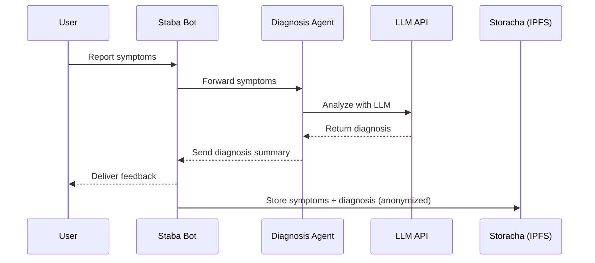

# 🩺 Staba – AI-Powered Symptom & Diagnosis Bot  

  
  
  
  

---

Staba is an **AI-powered medical assistant** that helps users report symptoms and receive preliminary diagnostic feedback through a conversational interface on **Telegram**.  
The system integrates with **Storacha** for decentralized, anonymized storage of user symptom–diagnosis data.  

---

## ⚡ Features
- 🤖 Telegram bot interface for reporting symptoms  
- 🧠 AI-driven diagnosis generation using LLMs (Gemini / OpenAI via ElizaOS)  
- 📦 Decentralized storage of anonymized reports on **Storacha (IPFS)**  
- 🔒 Privacy-first design – sensitive data never leaves your control  
- 🔌 Modular ElizaOS agent architecture  

---

## 📋 Prerequisites
- **Node.js** version 22 or higher  
- **pnpm** package manager  
- **Git**  
- **Telegram** account (for bot creation)  
- **OpenRouter API key** (for LLMs like OpenAI/Gemini)  
- **Storacha account + w3cli tools**  

---

## 🚀 Installation Steps  

### 1. Clone the Repository  
```bash
git clone https://github.com/Fatumayattani/staba
cd staba
````

### 2. Install Dependencies

```bash
pnpm install
```

### 3. Set Up Storacha Integration

a. Install **w3cli tool**

```bash
npm install -g @web3-storage/w3cli
```

b. Generate a **DID (Decentralized Identifier)**

```bash
w3 key create
```

Save both:

* Private key (starts with `Mg...`)
* Public DID (starts with `did:key:`)

c. Create a **Space**

```bash
w3 space create staba-space
```

Save the **space DID**.

d. Create a **Delegation**

```bash
w3 delegation create \
  -c space/blob/add \
  -c space/index/add \
  -c filecoin/offer \
  -c upload/add <YOUR_AGENT_DID> --base64
```

Save the **delegation output** for `.env`.

👉 Refer to [Storacha docs](https://web3.storage/docs/) for details.

---

### 4. Set Up Telegram Bot

1. Go to [@BotFather](https://t.me/botfather) on Telegram
2. Create a new bot using `/newbot`
3. Save the **bot token**

---

### 5. Configure Environment Variables

Copy `.env.example` → `.env`:

```bash
cp .env.example .env
```

Edit `.env` with your keys:

```env
# Required API Keys
OPENROUTER_API_KEY="your-openrouter-api-key"
TELEGRAM_BOT_TOKEN="your-telegram-bot-token"

# Storacha Configuration
STORACHA__AGENT_PRIVATE_KEY="your-private-key-from-w3-key-create"
STORACHA__AGENT_DELEGATION="your-delegation-from-w3-delegation-create"
```

---

### 6. Start the Agent

```bash
pnpm start
```

For custom character configuration:

```bash
pnpm start --characters="path/to/your/character.json"
```

---

## 💬 Example Telegram Flows

**User → Staba**

```
/start
Hi Staba, I’ve been having headaches and dizziness for two days.
```

**Staba → User**

```
Thanks for sharing. Based on your symptoms, possible causes may include:
- Migraine
- Low blood sugar
- Dehydration

Would you like me to suggest next steps?
```

**User → Staba**

```
Yes, please.
```

**Staba → User**

```
Recommendation:
1. Drink water and rest.
2. If symptoms persist for >48 hours, consult a doctor.
3. If severe, seek urgent care.

Your (anonymized) report has been stored securely in Storacha ✅
```

---

## 🏗️ Architecture

### System Overview

```mermaid
graph TD
    User[👩 User on Telegram] -->|Reports Symptoms| Bot[🤖 Staba Bot (ElizaOS)]
    Bot -->|Sends Symptoms| DiagnosisAgent[🧠 Diagnosis Generator]
    DiagnosisAgent -->|Uses LLM API| LLM[🔮 Gemini / OpenAI API]
    LLM -->|Returns Insights| DiagnosisAgent
    DiagnosisAgent -->|Sends Report| Bot
    Bot -->|Delivers Feedback| User
    Bot -->|Stores Data (symptoms + diagnosis)| Storacha[📦 Storacha (IPFS)]
```

### Interaction Flow



---

## 🌍 Integration with Storacha

Staba directly integrates with **Storacha** for decentralized storage.

* Only **anonymized data** is stored
* Ensures **user privacy & verifiable research data**
* Uses `w3cli` delegation for secure agent uploads

---

## ⚠️ Disclaimer

Staba is **not a medical professional**.
It provides **informational feedback only** and should not replace a doctor’s diagnosis.
For urgent or severe symptoms, seek **immediate medical attention**.

```

