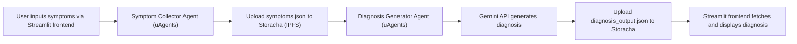

# 🧠 Staba

An intelligent ensemble AI system built with **Fetch.ai's uAgents**, **Storacha decentralized storage**, and **Gemini API** that collects user-reported health symptoms and provides AI-generated diagnosis reports. It also anonymously stores data for medical research.

---

## 📌 Overview

This project aims to bridge the gap between symptom self-reporting and actionable health insights. It enables users to receive personalized health feedback while contributing anonymized data to improve healthcare AI models.

- Agent 1 (Symptom Collector Agent): Accepts user health symptoms and uploads to Storacha.
- Agent 2 (Diagnosis Generator Agent): Fetches symptoms from Storacha, uses Gemini API to analyze, then outputs a report and uploads back to Storacha.

---

## 🚀 Key Technologies

- [🔁 Fetch.ai's uAgents](https://github.com/fetchai/uAgents): For building autonomous, decentralized AI agents.
- [📦 Storacha](https://docs.storacha.network): Decentralized, IPFS-backed data storage with access control.
- [🧠 Gemini API](https://ai.google.dev/gemini-api/docs): LLM API used to analyze symptoms and generate health insights.

---

## 🧩 Architecture



## 💡 Features

- **AI Agent Collaboration**: Two autonomous agents communicating via Storacha and sharing context.
- **Ensemble Learning**: Agent 2 learns from structured input by Agent 1 and builds insights.
- **Decentralized Storage**: All files uploaded/downloaded from IPFS via Storacha.
- **Research-Grade Data**: Anonymized symptom–diagnosis pairs are stored for future medical AI use.
- **Extensible**: Easily expandable to include more agents (e.g., nutrition, treatment suggester).

---

## 🧑‍⚕️ Use Cases

- Telehealth platforms
- Virtual health assistants
- Clinics analyzing aggregated symptom patterns
- Self-care mobile apps

---

## 💸 Business Model

- **Freemium model**: Free for individuals with optional premium features (e.g., historical data, export PDF reports).
- **B2B Licensing**: Clinics and health tech startups can license the anonymized data insights or integrate the diagnosis agent into their systems.

---

## 📁 Example Data Flow

### 1. `symptoms.json`
```json
{
  "user_id": "anon-123",
  "symptoms": "persistent cough, fatigue, shortness of breath"
}
```

Uploaded by Agent 1 to Storacha → Generates CID.

---

### 2. `diagnosis_output.json`
```json
{
  "possible_conditions": [
    "Bronchitis",
    "Chronic Obstructive Pulmonary Disease (COPD)"
  ],
  "recommendations": "Consult a pulmonologist. Ask about spirometry tests.",
  "source_agent": "diagnosis-generator",
  "timestamp": "2025-04-12T18:30:00Z"
}
```

Generated by Agent 2 using Gemini API and stored back on Storacha.

---

## 🛠️ In Progress

- [ ] Finalizing CLI for input and output.
- [ ] Connecting UI to fetch reports via CID.
- [ ] Adding security layer to anonymize and encrypt data further.
- [ ] Gemini fine-tuning for local language support (Swahili, etc.).

---

## 📣 Collaboration

This project is built for the **Spicy AI Collaboration with Storacha** Hackathon, focused on building **ensemble learning AI agents** powered by decentralized storage.

