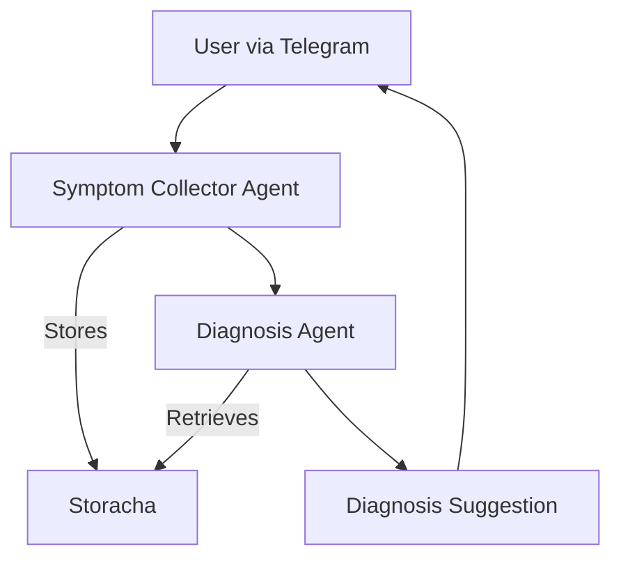

# 🤖 Staba – AI Health Assistant

[](https://github.com/elizaOS/eliza)
[](https://storacha.network/)
[](https://t.me/)

Staba is an AI-powered health assistant built with **ElizaOS** and **Storacha**.  
It consists of two main agents:
- 📝 **Symptom Collector Agent** → Collects symptoms interactively via Telegram.  
- 🧠 **Diagnosis Agent** → Analyzes structured data and suggests possible diagnoses.  

Data is stored **decentrally on Storacha**, ensuring privacy and security.

---

## 🌟 Features

- Multi-agent architecture (Symptom Collector + Diagnosis Agent)
- Telegram Bot integration
- Decentralized storage with Storacha
- Powered by ElizaOS for flexible agent orchestration
- Extendable with custom agents and plugins

---

## 📦 Prerequisites

- [Node.js](https://nodejs.org/) v22 or higher
- [pnpm](https://pnpm.io/) package manager
- [Git](https://git-scm.com/)
- [Telegram](https://core.telegram.org/bots) account (for bot creation)
- [OpenRouter API key](https://openrouter.ai/)
- [Storacha](https://storacha.network/) account + `w3cli` tool

---

## ⚙️ Installation

1. **Clone the Repository**

```bash
git clone https://github.com/Fatumayattani/staba
cd staba
````

2. **Initialize Project & Install ElizaOS**

```bash
pnpm init
pnpm add elizaos
```

3. **Install Dependencies**

```bash
pnpm install
```

---

## 🗂 Storacha Integration

1. Install `w3cli`:

```bash
npm install -g @web3-storage/w3cli
```

2. Generate a DID:

```bash
w3 key create
```

Save both **private key** (starts with `Mg...`) and **public DID** (`did:key:...`).

3. Create a Space:

```bash
w3 space create staba-space
```

4. Create Delegation:

```bash
w3 delegation create -c space/blob/add -c space/index/add -c filecoin/offer -c upload/add <YOUR_AGENT_DID> --base64
```

Save the delegation output for your `.env`.

---

## 🤖 Telegram Bot Setup

1. Go to [@BotFather](https://t.me/BotFather) on Telegram
2. Run `/newbot` and follow the prompts
3. Save the **bot token** provided

---

## 🔑 Environment Variables

Create a `.env` file in your project root:

```bash
cp .env.example .env
```

Fill in your keys:

```env
# Required
OPENROUTER_API_KEY="your-openrouter-api-key"
TELEGRAM_BOT_TOKEN="your-telegram-bot-token"

# Storacha
STORACHA__AGENT_PRIVATE_KEY="your-private-key"
STORACHA__AGENT_DELEGATION="your-delegation"

# WebSocket (optional)
WS_URL="wss://staba-production.up.railway.app/"
```

---

## 🧩 Agents Setup

Create an `agents/` folder:

```bash
mkdir agents
```

Example `agents/symptom_collector.json`:

```json
{
  "name": "SymptomCollector",
  "description": "Collects symptoms from the user via Telegram and structures them.",
  "plugins": ["telegram", "storacha"],
  "inputs": ["symptom"],
  "outputs": ["structured_symptom_data"]
}
```

Example `agents/diagnosis_agent.json`:

```json
{
  "name": "DiagnosisAgent",
  "description": "Analyzes structured symptoms and suggests possible diagnoses.",
  "plugins": ["openai", "storacha"],
  "inputs": ["structured_symptom_data"],
  "outputs": ["diagnosis_suggestion"]
}
```

---

## 🚀 Running the Project

Start the agents together:

```bash
pnpm start --characters="agents/symptom_collector.json,agents/diagnosis_agent.json"
```

---

## 📱 Sample Bot Interaction

**User →**
Hi, I’m feeling unwell.

**Bot (Symptom Collector) →**
Can you describe your symptoms?

**User →**
I have a sore throat and mild fever.

**Bot (Diagnosis Agent) →**
Based on your symptoms, it could be a common cold or flu.
Would you like me to suggest self-care steps?

---

## 📊 Architecture



---

## 🙌 Acknowledgments

* [ElizaOS](https://github.com/elizaOS/eliza) – Agent framework
* [Storacha](https://storacha.network/) – Decentralized storage
* Inspired by [Tripmate-Planner](https://github.com/Dhruv-Varshney-developer/Tripmate-Planner)

```


